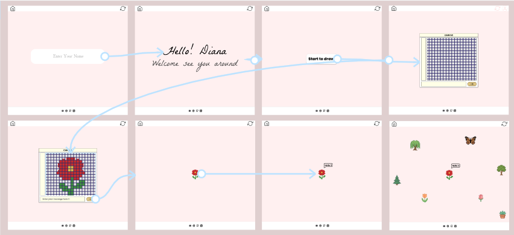
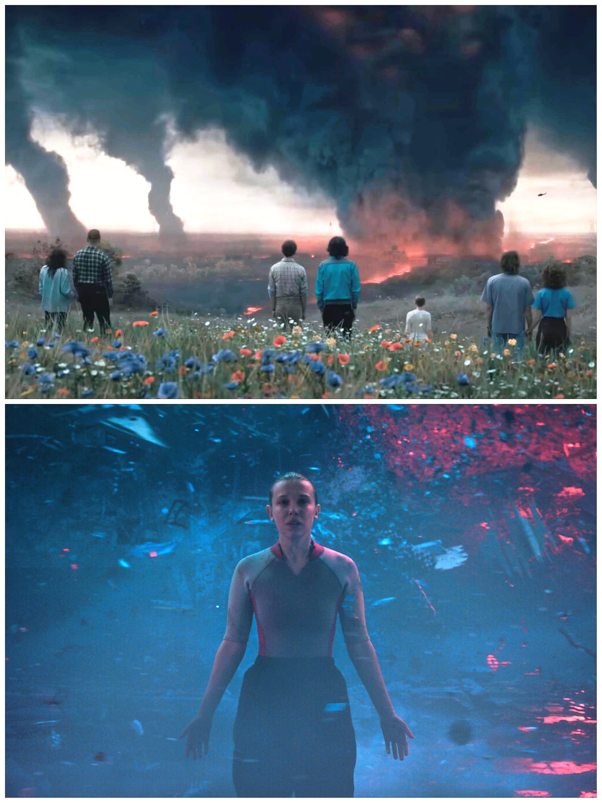

# ELL, I See You Around

 (Click on the badge to access the site)
also link available (https://elliseeyouaround.netlify.app/)

---

## Introduction

ELL, I See You Around is an interactive web experience where users can create pixel-art flowers, attach short messages to them, and place them within a shared digital flower field. Over time, individual drawings and messages collectively form a living garden created by everyone who visits the website. The project was designed and developed using HTML, CSS, and JavaScript, with a focus on creating a simple and visually calming experience. Rather than functioning as a traditional social platform, the website encourages quiet interaction through creativity, allowing visitors to leave a small piece of themselves behind for others to discover.

## Tech Stack

| Category | Technologies |
|----------|-------------|
| Front-End | HTML5, CSS3, JavaScript, Firebase |
| Tools | Visual Studio Code, Figma, Google Fonts, Font Awesome |
| Deployment | Netlify |
---

## Design & Prototyping

Before development began, the project was planned through interface sketches and design prototypes to establish the visual style, layout structure, and user interaction flow. Particular attention was given to creating a soft visual aesthetic through pastel colors, minimal interface elements, and an open digital landscape where flowers can be freely placed and discovered.

---

## Inspiration

The idea for *ELL, I See You Around* was inspired by a scene from *Stranger Things* featuring a vast field of flowers existing alongside an atmosphere of uncertainty and transformation. The contrast between beauty and mystery left a lasting impression and became the foundation for this project. The name **ELL** is inspired by the character Eleven ("El"), while intentionally being adapted into its own identity. The phrase *"I See You Around"* reflects the idea that people may come and go, leave messages behind, and perhaps never meet, yet their presence remains visible through the flowers they create.
The project explores the concept of strangers communicating without direct conversation. Each flower becomes a small visual memory, creating a digital space where creativity, curiosity, and personal expression quietly coexist.

---

## Author

**Tanuja M. Modak**
ELL, I See You Around was developed as a personal front-end project exploring interactive web design, creative storytelling, and user-generated digital experiences. The project combines inspiration from visual media with technical implementation to create a shared online space built around art, messages, and discovery.
